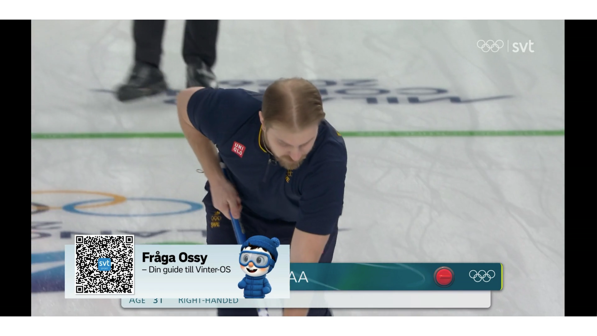
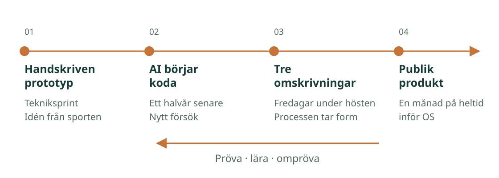
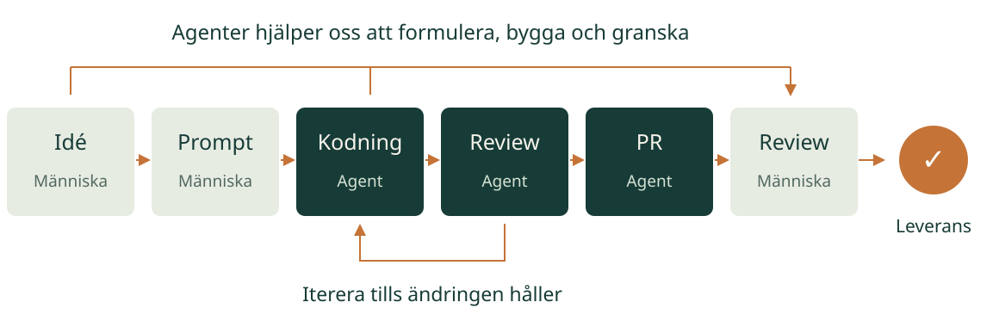
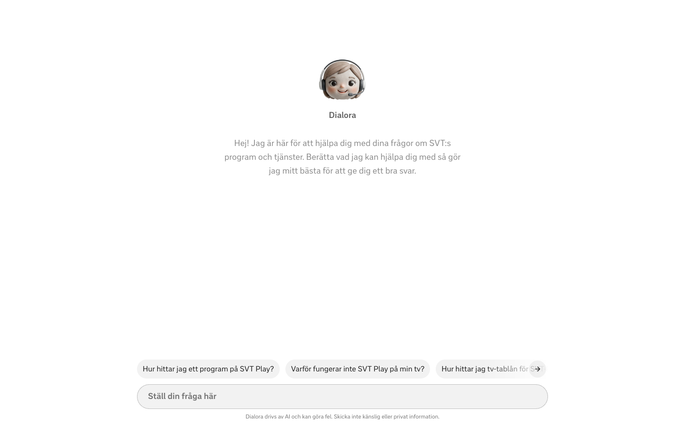
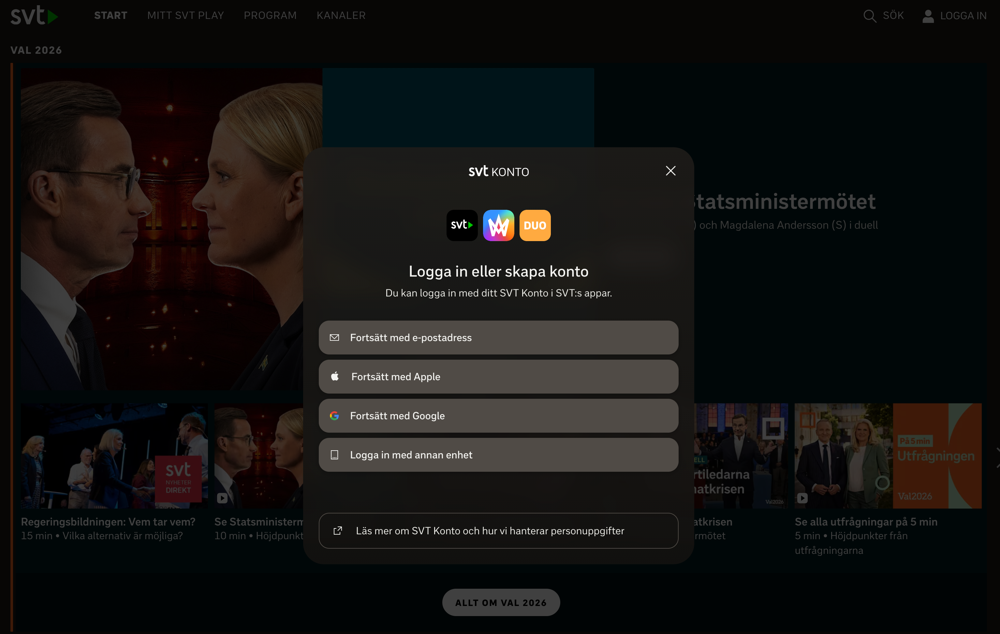
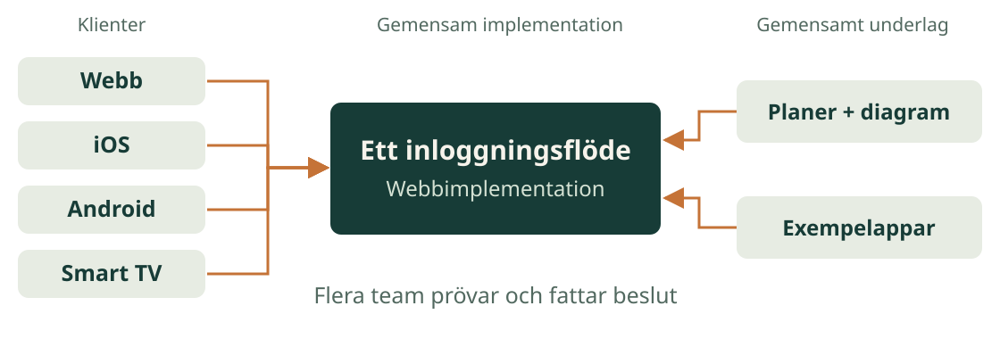
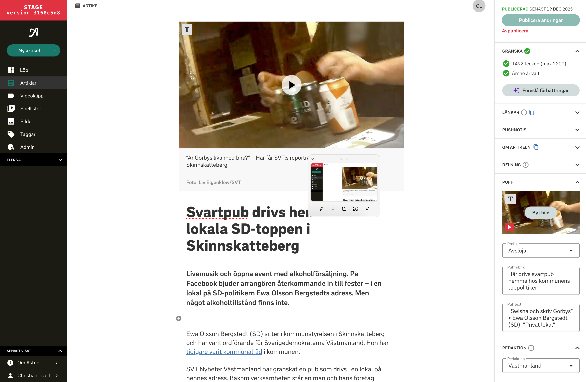
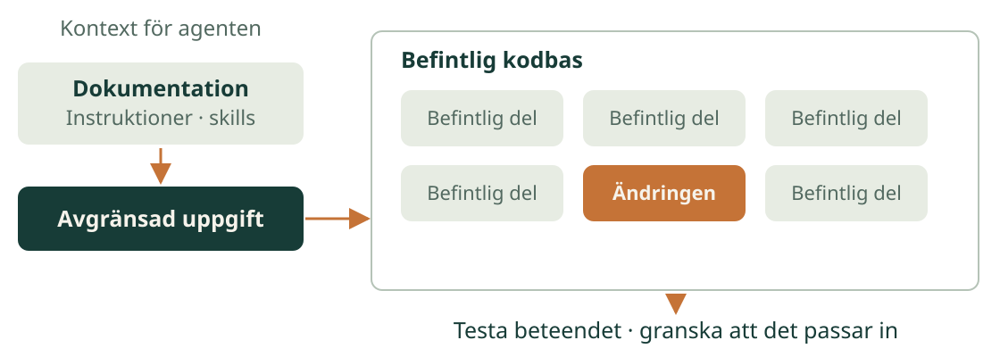
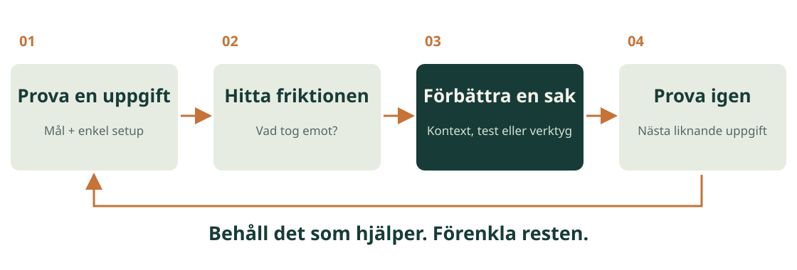

<style>
:root { --r-main-font: 'Avenir Next', 'Trebuchet MS', sans-serif; --r-heading-font: 'Avenir Next', 'Trebuchet MS', sans-serif; --r-main-font-size: 36px; --r-background-color: #f6f3eb; --r-main-color: #173c37; --r-heading-color: #173c37; --r-link-color: #176c59; }
.reveal { background: #f6f3eb; color: #173c37; }
.reveal .slides { text-align: left; }
.reveal .slides > section:not(.stack), .reveal .slides > section > section { box-sizing: border-box; height: 720px; padding: 65px 72px; }
.reveal h1, .reveal h2 { background: none; -webkit-text-fill-color: currentColor; color: #173c37; text-transform: none; font-weight: 700; letter-spacing: -.045em; line-height: 1.1; max-width: 100%; margin: 16px 0 32px; }
.reveal h1 { font-size: 2.2em; } .reveal h2 { font-size: 1.7em; }
.reveal p, .reveal li { color: #173c37; font-size: .86em; font-weight: 400; line-height: 1.4; }
.reveal strong { color: #176c59; font-weight: 700; }
.reveal .kicker { font-family: 'Menlo', monospace; font-size: 16px; letter-spacing: .13em; text-transform: uppercase; color: #526960; margin: 0 0 30px; }
.reveal .subtitle { font-size: 32px !important; color: #526960 !important; line-height: 1.4 !important; }
.reveal .byline { margin-top: 46px; font-size: 21px !important; color: #526960 !important; }
.reveal .cols { display: grid; grid-template-columns: 1fr 1fr; gap: 48px; margin-top: 35px; }
.reveal .cols > div { border-top: 3px solid #c57337; padding-top: 20px; }
.reveal h3 { font-size: 27px; color: #176c59; text-transform: none; margin: 0 0 15px; }
.reveal ul, .reveal ol { max-width: 100%; margin: 0; padding-left: 30px; }
.reveal li { margin-bottom: 18px; }
.reveal .callout { border-left: 5px solid #c57337; padding: 10px 0 10px 26px; font-size: 34px; margin-top: 32px; }
.reveal .flow { display: flex; align-items: center; gap: 15px; margin: 60px 0 35px; }
.reveal .flow b { border-top: 4px solid #c57337; padding: 22px 8px; font-size: 26px; flex: 1; }
.reveal .flow span { color: #176c59; }
.reveal .small { font-size: 21px; color: #526960; }
.reveal pre { box-sizing: border-box; width: 100%; margin: 24px 0; padding: 24px; background: #173c37; border: 0; border-radius: 0; box-shadow: none; font-size: 23px; }
.reveal pre code.hljs { background: #173c37; }
.reveal pre code { font-family: 'Menlo', monospace; font-size: inherit; line-height: 1.45; max-height: none; color: #f6f3eb; white-space: pre-wrap; }
.reveal table { width: 100%; margin: 28px 0; border-collapse: collapse; }
.reveal table th { color: #176c59; font-size: 22px; border-bottom: 2px solid #176c59; padding: 14px; }
.reveal table td { color: #173c37; font-size: 27px; border-bottom: 1px solid #bbc7ba; padding: 18px 14px; }
.reveal .chapter { background: #173c37; }
.reveal .chapter h1, .reveal .chapter h2, .reveal .chapter p, .reveal .chapter strong { color: #f6f3eb; }
.reveal .chapter .kicker { color: #eab88b; }
.reveal .chapter h1 { font-size: 2.65em; margin-top: 64px; }
.reveal .slide-number { color: #526960; font-family: 'Menlo', monospace; font-size: 15px; }
.reveal .controls, .reveal .progress { color: #176c59; }
.reveal .progress span { background: #c57337; }
.reveal a { text-decoration: underline; text-underline-offset: 4px; }
@media print { .reveal .slides > section:not(.stack), .reveal .slides > section > section { -webkit-print-color-adjust: exact; print-color-adjust: exact; } }

.reveal .slides > section.stack { padding: 0; height: 720px; }
.reveal .case-grid { display: grid; grid-template-columns: repeat(3, 1fr); gap: 30px; margin: 34px 0; }
.reveal .case-grid > div { border-top: 3px solid #c57337; padding-top: 18px; }
.reveal .case-grid p { font-size: 26px; }
.reveal .case-grid h3 { font-size: 23px; }
.reveal .case-step { display: block; font: 17px 'Menlo', monospace; color: #526960; margin-bottom: 16px; }
.reveal .case-nav { font: 17px 'Menlo', monospace; color: #526960; margin-top: 28px; }
.reveal .slides > section:first-child .kicker { font-size: 16px; color: #526960; line-height: 1.4; }

.reveal .slides > section > section.demo-slide { padding: 32px 72px; }
.reveal .demo-slide .kicker { margin-bottom: 12px; }
.reveal .demo-slide h2 { font-size: 44px; margin: 0 0 20px; }
.reveal .demo-screenshot { display: block; width: 100%; height: 500px; object-fit: contain; margin: 0; border: 0; background: none; box-shadow: none; }

.reveal .reference h1 { font-size: 1.75em; margin-bottom: 24px; }
.reveal .term-grid { display: grid; grid-template-columns: 1fr 1fr; gap: 24px 40px; }
.reveal .term-grid > div { border-top: 3px solid #c57337; padding-top: 14px; }
.reveal .term-grid h3 { font-size: 26px; margin-bottom: 10px; }
.reveal .term-grid p { font-size: 25px; margin: 0; }
.reveal .reference .cols p { font-size: 27px; }
.reveal .reference .callout { font-size: 29px; }

.reveal .slides > section > section.media-slide, .reveal .slides > section > section.diagram-slide { padding: 44px 60px; }
.reveal .media-slide .kicker, .reveal .diagram-slide .kicker { margin-bottom: 18px; }
.reveal .case-media { display: grid; grid-template-columns: 320px minmax(0, 1fr); gap: 32px; align-items: center; min-height: 490px; }
.reveal .case-media h1 { font-size: 51px; line-height: 1.1; margin: 0 0 26px; }
.reveal .case-media .media-copy p { font-size: 26px; line-height: 1.4; }
.reveal .case-media figure { margin: 0; min-width: 0; }
.reveal .case-media img { display: block; width: 100%; max-width: 100%; max-height: 490px; object-fit: contain; margin: 0; border: 0; background: none; box-shadow: 0 8px 26px #173c3720; }
.reveal .case-media video { display: block; width: 100%; max-width: 100%; max-height: 470px; margin: 0; background: #111; }
.reveal .case-media figcaption { font-size: 17px; line-height: 1.35; color: #526960; margin-top: 10px; }
.reveal .media-slide .case-nav { margin: 14px 0 0; }
.reveal .diagram-slide h1 { font-size: 58px; margin: 0 0 18px; }
.reveal .diagram-image { display: block; width: 100%; max-width: 100%; max-height: 370px; margin: 12px 0; border: 0; background: none; box-shadow: none; }
.reveal .diagram-slide .small { font-size: 19px; margin: 10px 0 0; }
.reveal .case-media .video-print { display: none; }
html.print-pdf .reveal .case-media video { display: none; }
html.print-pdf .reveal .case-media .video-print { display: block; }
@media print { .reveal .case-media video { display: none; } .reveal .case-media .video-print { display: block; } }
.reveal .slides .about-athega .cols p, .reveal .slides .about-athega .callout { color: #173c37; font-size: 28px; }
</style>

<p class="kicker">Code Base · Järvsö · 19 september 2026</p>

# Kom igång med AI<br>i utvecklingsarbetet

<p class="subtitle">Så här gjorde vi på SVT</p>
<p class="byline">Christian Lizell · Athega / SVT Nyheter &amp; Sport</p>
<p class="case-nav">↓ Om mig · om Athega</p>

Note:
00:00–01:00 · 1 min

”Jag vill att ni går härifrån med en uppgift ni kan prova på måndag – och ett sätt att avgöra om resultatet håller.”

- Jag heter Christian och jobbar med utveckling på SVT.
- Ni arbetar med både nya lösningar, integrationer och förvaltning. Vi har använt AI i tre situationer som jag tror ni kan känna igen er i. Jag tänkte visa hur arbetssättet vuxit fram och vad ni kan ta med er.
- Ställ gärna frågor under tiden. Blir det en längre diskussion tar vi den på slutet.

**Vidare:** ”Först vill jag veta lite om er.”


--

<!-- .slide: class="diagram-slide" -->
<p class="kicker">Om mig · valbar fördjupning</p>


Note:
Valbar introduktion · cirka 30 sekunder

”Jag heter Christian Lizell och kommer från Athega. Min bakgrund finns mycket i medievärlden – här är några av sammanhangen.”

- Peka ut ett par logotyper som hjälper publiken förstå din bakgrund.
- ”I dag utgår jag från arbetet på SVT Nyheter och Sport, där vi har provat AI i både nya och befintliga produkter.”

**↓ Athega:** ”Och Athega är konsultbolaget jag kommer ifrån.”
**→ Huvudspåret:** ”Men först – var befinner ni er?”

--

<!-- .slide: class="diagram-slide about-athega" -->
<p class="kicker">Om Athega · valbar fördjupning</p>


# Det här hjälper vi er med.

<div class="cols"><div><h3>Bygga och vidareutveckla system</h3><p>Erfarna utvecklare i era team.<br>Nya lösningar, modernisering och förvaltning.</p></div><div><h3>Få AI att fungera i praktiken</h3><p>AI och maskininlärning i era produkter och processer.<br>AI som arbetssätt i utvecklingen.</p></div></div>
<p class="callout">Nyfikna på att utforska nytt, med erfarenhet av vad som håller.</p>

Note:
Valbar introduktion · cirka 45 sekunder

”Det finns tre ganska konkreta sätt som Athega kan hjälpa till på.”

- ”Vi går in som erfarna utvecklare i teamen. Det kan vara att bygga nytt, modernisera ett befintligt system eller fortsätta utveckla och förvalta det som redan används.”
- ”Vi hjälper till att få AI att fungera i praktiken: i produkter, analys och automation, men också som arbetssätt för utveckling. Det senare är ju vad vi tittar på i dag.”
- ”Vi gör också tekniska granskningar. Inför ett förvärv eller en investering behöver man förstå vad man köper: kod, arkitektur, risker och vad det krävs för att utveckla vidare.”

”Vi har bland annat arbetat inom medier, tillverkning och finans. Vi kan gå in och bygga tillsammans med er, eller hjälpa er förstå vad nästa tekniska steg behöver vara.”

Underlag: Athegas företagspresentation, tillhandahållen av Christian.

**→ Huvudspåret:** ”Men nu till er – var befinner ni er själva med AI?”


---

<p class="kicker">Start · handuppräckning</p>

# Var befinner ni er?

<div class="cols"><div><h3>Har provat</h3><p>Chatt, kodförslag eller autocomplete.</p></div><div><h3>Jobbar med agent</h3><p>Verktyget läser filer, ändrar kod och kör tester.</p></div></div>
<p class="callout">Vem har fått ett övertygande svar som var fel?</p>

Note:
01:00–02:00 · 1 min

**Handuppräckning – låt händerna komma upp mellan frågorna.**

- ”Vilka har provat AI för att få hjälp med kod?”
- ”Vilka låter en agent läsa filer, ändra kod och köra tester?”
- ”Vilka har fått ett väldigt övertygande svar som visade sig vara fel?”

”Det är den sista frågan vi ska ha med oss i dag. Hur får vi nytta av hjälpen och upptäcker när det blir fel?”

**Vidare:** ”Vi börjar med tre konkreta erfarenheter.”


---

<p class="kicker">Dagens väg</p>

# En liten uppgift.<br>Hela vägen till leverans.

<div class="flow"><b>Tre case</b><span>→</span><b>Första uppgiften</b><span>→</span><b>Review</b><span>→</span><b>Er start</b></div>
<p class="small">40 minuter tillsammans · 5 minuter frågor · inga datorer behövs</p>

Note:
02:00–03:00 · 1 min

”Ossy, Login och Astrid hade helt olika utgångslägen. En ny produkt, en omskrivning med många beroenden och ett system som redan var i drift.”

- Först: vad som hjälpte oss i de tre situationerna.
- Sedan: en liten uppgift, från första beställning till granskad ändring.
- Ni får granska ett förslag och formulera ett eget försök. Inga datorer behövs.

**Vidare:** ”Ossy började med att sporten hade en idé.”


---

<!-- .slide: class="media-slide" -->
<p class="kicker">Case 1 · Ossy · ny produkt</p>

<div class="case-media"><div class="media-copy"><h1>Från idé<br>till publik<br>produkt.</h1><p>Sportens idé blev en OS-chatbot.</p><p>Och en grund för fler kunskapsbottar.</p></div><figure><video controls data-autoplay muted playsinline preload="metadata" poster="assets/images/ossy-curling-poster.png" aria-label="Ossy visas i SVT:s curlingsändning" src="assets/media/ossy-curling.mp4"></video><figcaption>Ossy i sändning · <a href="assets/media/ossy-curling.mp4" target="_blank" rel="noopener">19 sekunder utan ljud</a></figcaption></figure></div>
<p class="case-nav">↓ Resan · arbetsloopen · ramverket · Dialora</p>

Note:
03:00–03:45 · 45 sek inklusive valfritt klipp · Ossy klart vid 07:00

**Klippet startar automatiskt. Berätta medan det spelas; pausa med videokontrollen vid behov.** Ossy syns som ett inslag i sändningen; pausbilden visar samma poäng om du hoppar över uppspelningen.

”Sporten ville bygga publikens bästa vän under OS. En chatbot som kunde svara på frågor. Vi började under en tekniksprint, när vi fick jobba med lite andra idéer.”

- Då var frågan: går det ens att bygga något som liknar ChatGPT?
- Första försöket kodade vi för hand. Agentisk utveckling var ännu inte ett fungerande arbetssätt för oss.
- Så småningom blev det både en färdig produkt och ett ramverk för fler bottar.

**↓ Resan:** ”Men vi kom inte dit på första försöket.”


--

<!-- .slide: class="diagram-slide" -->
<p class="kicker">Ossy · fördjupning 1/3</p>

# Tre omskrivningar.<br>En process som tog form.



Note:
03:45–04:45 · 1 min

”Vi fick något att fungera, men vi var inte där vi ville vara. Sedan låg det still i ungefär ett halvår.”

- Nästa tekniksprint: AI-kodning hade börjat bli användbar. Kunde AI skriva koden till vår AI-produkt?
- Det gick nästan – och bättre än vi hade väntat oss.
- Vi fortsatte på fredagar under hösten. Skrev om hela kodbasen tre gånger och lärde oss längs vägen.
- Inför OS fick vi en månad på heltid. Då blev det en produkt som användes flitigt.

**↓ Arbetsloopen:** ”Under den här resan bestämde vi oss för att använda AI genom hela utvecklingsarbetet.”


--

<!-- .slide: class="diagram-slide" -->
<p class="kicker">Ossy · fördjupning 2/3</p>

# Vår utvecklingsloop.



Note:
04:45–05:45 · 1 min

”Vi var tre utvecklare och en redaktionell person. Till slut använde vi AI för att utreda, bygga, testa, jobba med UX och granska.”

- **Promptjam:** vi formar mål, avgränsningar och vad som ska räknas som klart tillsammans.
- Agenten kodar och granskar. Kod och agentreview går i en loop tills ändringen är redo för en PR.
- Vi gör den mänskliga granskningen före leverans: beteende, avgränsning och om lösningen håller. Behövs ändringar går arbetet tillbaka till agenten.
- Agenter kan även hjälpa oss utveckla beställningen och förstå ändringen. Vi äger fortfarande besluten.
- AI hjälpte också till att bedöma chatbotens svar. Vi behövde fortfarande egen kontroll och uppföljning i drift.

**Landning:** ”All kod kunde genereras med AI. Besluten om vad vi skulle bygga och släppa låg fortfarande hos oss.”

**↓ Ramverket:** ”Och arbetet gav oss något som gick att använda igen.”


--

<p class="kicker">Ossy · fördjupning 3/3</p>

# Från en OS-bot<br>till ett ramverk för fler.

<div class="cols"><div><h3>Gemensam grund</h3><p>Skapa bottar enkelt och säkert.<br>Återanvänd arbetet från Ossy.</p></div><div><h3>Specifik kunskap</h3><p>Ge varje bot ett tydligt område.<br>Gör kunskap tillgänglig som annars inte finns att få på samma sätt.</p></div></div>
<p class="callout">Produkten blev också en förmåga att bygga nästa bot.</p>

Note:
05:45–07:00 · 1 min 15 sek · Med demo: 30 sek här + 45 sek nedåt

”Ossy blev också ett ramverk för att skapa bottar enkelt och säkert, med specifik kunskap som inte finns tillgänglig på samma sätt annars.”

- Vi kunde återanvända grunden från Ossy för fler bottar.
- Varje bot kan få ett tydligt kunskapsområde.
- Arbetet med den första produkten gav oss en förmåga att bygga nästa.

**Med exempel ↓:** ”Dialora är ett exempel på det.”

**Utan demo → Login:** ”I nästa case fanns redan en lösning. Utmaningen var att samla den över flera team och plattformar.”


--

<!-- .slide: class="demo-slide" -->
<p class="kicker">Ossy · valbart exempel · högst 45 sekunder</p>

## Ett exempel: Dialora



Note:
Valbart exempel · max 45 sek · Vidare till Login senast 07:00

”Här är Dialora. Den hjälper till med frågor om SVT:s program och tjänster. Ett exempel på vad vi kan bygga med ramverket.”

- Peka på introduktionen och de föreslagna frågorna i skärmbilden. Botens kunskapsområde är tydligt avgränsat.
- **Poängen:** ett gemensamt ramverk kan användas för flera bottar med olika kunskapsområden.

**→ Login:** ”Nu till en annan sorts uppgift: ett gemensamt login i en miljö där mycket redan fanns.”


---

<!-- .slide: class="media-slide" -->
<p class="kicker">Case 2 · Login · omskrivning</p>

<div class="case-media"><div class="media-copy"><h1>En gemensam<br>väg in.</h1><p>Flera plattformar.<br>Flera team.</p><p><strong>I produktion<br>9 september 2026.</strong></p></div><figure><a href="assets/images/svt-login.png" target="_blank" rel="noopener"></a><figcaption>SVT Konto i SVT Play</figcaption></figure></div>
<p class="case-nav">↓ Planerna · exempelapparna</p>

Note:
07:00–08:00 · 1 min · Login klart vid 11:00

”Vi hade flera inloggningslösningar på olika ställen och plattformar. Vi ville göra en gemensam webbimplementation och integrera den i de olika klienterna.”

- Webb, iOS, Android och andra plattformar behövde fungera tillsammans.
- Flera team behövde diskutera både lösningen med webbvyer och AI-utvecklad kod.
- Här blev planer, prototyper och gemensamma beslut en stor del av arbetet.

**↓ Planerna:** ”En av de viktigaste sakerna jag gjorde var faktiskt att skriva Markdown-filer.”


--

<!-- .slide: class="diagram-slide" -->
<p class="kicker">Login · fördjupning 1/2</p>

# Vi kunde fråga planen<br>innan koden fanns.


<p class="small">Schematisk målbild</p>

Note:
08:00–09:30 · 1,5 min

”Jag skrev planer som beskrev hur det skulle fungera – från helheten till arkitektur och nätverksflöden.”

- Vi kunde ställa frågor till planerna nästan som om koden redan fanns: ”Vad händer om vi gör så här? Vad påverkas då?”
- Samma innehåll gick att visa som text och diagram när vi pratade med varandra.
- När en del var tillräckligt tydlig kunde jag ge den till en agent och börja bygga.

**Landning:** ”Planen blev något vi kunde arbeta med tillsammans. Den hjälpte oss att få syn på frågor innan vi var mitt i implementationen.”

**↓ Exempelappar:** ”Sedan behövde vi också kunna känna på lösningen.”


--

<p class="kicker">Login · fördjupning 2/2</p>

# Exempelappar gjorde<br>lösningen möjlig att pröva.

<div class="case-grid"><div><span class="case-step">01</span><h3>Tidigt</h3><p>Exempelappar för de olika plattformarna.</p></div><div><span class="case-step">02</span><h3>Tillsammans</h3><p>UX och produktägare kunde känna på flödet.</p></div><div><span class="case-step">03</span><h3>Vidare</h3><p>Diskutera lösningen och gå vidare med implementationen.</p></div></div>
<p class="callout">Lärdomen: gör lösningen konkret för dem som ska fatta besluten.</p>

Note:
09:30–11:00 · 1,5 min

”Vi byggde tidigt exempelappar för de olika plattformarna. Då kunde även UX och produktägare prova hur flödet skulle kännas.”

- Det gav oss något konkret att diskutera över teamgränserna.
- Planerna hjälpte oss resonera om helheten. Exempelapparna gjorde det möjligt att prova upplevelsen.
- **Vi gick live den 9 september 2026.** Pausa och låt resultatet landa.

”För mig är det här en viktig del av att utveckla med AI: att göra det lättare för flera människor att förstå och fatta beslut om samma lösning.”

**→ Astrid:** ”Det tredje caset handlar om att ändra arbetssätt i ett system som redan används varje dag.”


---

<!-- .slide: class="media-slide" -->
<p class="kicker">Case 3 · Astrid CMS · vidareutveckling</p>

<div class="case-media"><div class="media-copy"><h1>Samma CMS.<br>Nytt sätt<br>att utveckla.</h1><p>Flera års handskriven kod.</p><p>Nu helt AI-driven vidareutveckling.</p></div><figure><a href="assets/images/astrid-cms.png" target="_blank" rel="noopener"></a><figcaption>Astrid · artikelredigering i stage</figcaption></figure></div>
<p class="case-nav">↓ Kontexten · det stegvisa införandet</p>

Note:
11:00–12:00 · 1 min · Astrid klart vid 15:00

**Peka kort på redigeringen och publiceringskontrollerna.**

”Astrid är vårt CMS för nyheter. Ett komplext system som byggts under flera år och är format efter vad redaktörerna behöver.”

- Kodbasen var handskriven. Det fanns redan struktur, regler och invanda sätt att lösa saker.
- Vi har gått över till helt AI-driven utveckling även där.
- Produkten fortsätter vara i drift medan vi vidareutvecklar den.

**↓ Kontexten:** ”Då måste agenten kunna arbeta på kodbasens villkor.”


--

<!-- .slide: class="diagram-slide" -->
<p class="kicker">Astrid · fördjupning 1/2</p>

# Agenten behövde lära sig<br>hur kodbasen fungerar.


<p class="small">Principbild: en avgränsad ändring i en etablerad kodbas</p>

Note:
12:00–13:30 · 1,5 min

”I Astrid behöver AI följa de regler och idéer som redan finns. Den kan inte börja göra om allt så fort den får en annan idé.”

- Dokumentation hjälper agenten förstå systemet.
- Agentinstruktioner beskriver hur den ska arbeta i just den här kodbasen.
- Skills kan stödja sådant som återkommer.

**Landning:** ”En ändring ska fungera och passa in. Därför blir kontexten en del av utvecklingsarbetet.”

**↓ Införandet:** ”Och vi behöver inte börja med att ge den den största uppgiften.”


--

<p class="kicker">Astrid · fördjupning 2/2</p>

# Börja litet.<br>Utöka med erfarenheten.

<div class="flow"><b>Liten uppgift</b><span>→</span><b>Relevant kontext</b><span>→</span><b>Större uppgifter</b></div>
<p>Arbetssättet ändrades medan produkten fortsatte vara i drift.</p>
<p class="callout">Lärdomen: låt agentens uppgifter växa i takt med er förmåga att styra dem.</p>

Note:
13:30–15:00 · 1,5 min

”Vi behövde börja litet och sedan utöka till större och mer komplicerade uppgifter. Samtidigt behövde agenten tillräcklig kontext för att följa vårt upplägg.”

- En liten uppgift gör det lättare att se om agenten förstått kodbasen.
- När något blir fel: använd det för att hitta vilken kontext eller avgränsning som saknas.
- Den gamla koden finns kvar. Det är sättet att vidareutveckla den som har förändrats.

**Landning:** ”Ni kan börja där ni står, även med ett befintligt system i drift.”

**→ Gemensam lärdom:** ”Så vad har de här tre resorna gemensamt?”


---

<p class="kicker">Från våra case till er vardag</p>

# Nyutveckling.<br>Integration. Förvaltning.

<div class="case-grid"><div><span class="case-step">01 · OSSY</span><h3>En ny kundlösning</h3><p>Prova ett flöde tidigt och bygg återkopplingen samtidigt.</p></div><div><span class="case-step">02 · LOGIN</span><h3>Flera system och team</h3><p>Gör planer och prototyper till gemensamt beslutsunderlag.</p></div><div><span class="case-step">03 · ASTRID</span><h3>Ett CMS i drift</h3><p>Lär agenten den befintliga kodbasen och börja med en liten ändring.</p></div></div>

Note:
15:00–16:00 · 1 min

”Ni arbetar med Optimizely, Microsoftmiljöer, integrationer och förvaltning. Jag tror de här startlägena är ganska bekanta.”

- **Ossy:** en ny lösning där vi kan prova oss fram tillsammans med dem som ska använda den.
- **Login:** flera system, plattformar och team behöver fungera ihop.
- **Astrid:** ett befintligt CMS där användarna behöver kunna fortsätta jobba.

”I Jonas pass får ni konkreta implementationer kring CMS och Graph. Här fokuserar vi på hur ni kan använda AI för att förstå, avgränsa och kontrollera en sådan förändring.”

**Vidare:** ”Vilken liten uppgift i ert uppdrag skulle vara värd ett första försök?”

---

<!-- .slide: class="chapter" data-background-color="#173c37" -->
<p class="kicker">02 · Från första prompt</p>

# Ge agenten ett jobb<br>som går att avsluta.

<p>Scope · kontext · klart när</p>

<p class="case-nav">↓ Begrepp</p>

Note:
16:00–16:30 · 30 sek

”Med agent menar jag här en AI som kan läsa filer, ändra kod och köra verktyg. Då behöver vi ge den ett jobb som går att avsluta.”

- Vad ska bli bättre?
- Var får den ändra?
- Hur ser vi att det blev rätt?

**Vidare:** ”Börja med något där ni själva kan bedöma svaret.”

**Fördjupning ↓:** Begrepp. Välj en relevant bild vid frågor; högerpil fortsätter huvudspåret.

--

<!-- .slide: class="reference" -->
<p class="kicker">Begrepp</p>

# Modellen föreslår.<br>Agenten kan också agera.

<div class="term-grid"><div><h3>Modell / LLM</h3><p>En språkmodell som genererar text, kod och förslag utifrån sin indata.</p></div><div><h3>Agent</h3><p>En modell i en arbetsloop med verktyg: läsa, agera, se resultat och fortsätta.</p></div><div><h3>Verktyg / tool</h3><p>En funktion agenten kan anropa, till exempel filsökning eller testkörning.</p></div><div><h3>Autocomplete</h3><p>Kodförslag medan du skriver. Du driver själv arbetet steg för steg.</p></div></div>

Note:
Valbar fördjupning · cirka 1 minut

”Skillnaden märks i vem som driver nästa steg. Med autocomplete skriver jag och får förslag. En agent kan själv läsa filer, göra en ändring och köra ett test inom sitt mandat.”

- Modellen är en del av agenten.
- Verktygen avgör vilka handlingar som är möjliga.
- Vi behöver kunna se vad som faktiskt utfördes.

**↓** Beställningen. **→** Tillbaka till huvudspåret.

--

<!-- .slide: class="reference" -->
<p class="kicker">Begrepp</p>

# Vad ber vi om – och när är det klart?

<div class="term-grid"><div><h3>Prompt</h3><p>Instruktionen eller frågan du ger modellen vid ett tillfälle.</p></div><div><h3>Brief / promptjam</h3><p>Briefen beskriver uppgiften. Promptjam är att forma den tillsammans.</p></div><div><h3>Scope</h3><p>Avgränsningen: vilket beteende och vilka delar får ändras?</p></div><div><h3>Acceptanskriterier</h3><p>Observerbara villkor för att godkänna resultatet. ”Klart när …”</p></div></div>

Note:
Valbar fördjupning · cirka 1 minut

”Sökexemplet ger oss alla fyra: prompten ber om en fix, briefen beskriver varför, scope begränsar ändringen och acceptanskriteriet säger noll anrop för blank input.”

- Bestäm vad som ska hända för användaren.
- Beskriv också vad som ska fortsätta fungera.

**↓** Kontexten agenten arbetar med.

--

<!-- .slide: class="reference" -->
<p class="kicker">Begrepp</p>

# Vad finns med i samtalet?

<div class="term-grid"><div><h3>Kontext</h3><p>Instruktioner, meddelanden, kod och verktygsresultat som modellen får se.</p></div><div><h3>Token / kontextfönster</h3><p>Token är textbitar. Kontextfönstret begränsar hur mycket modellen kan hantera åt gången.</p></div><div><h3>Kompaktering / minne</h3><p>Historik sammanfattas eller sparas för senare bruk. Detaljer kan gå förlorade.</p></div><div><h3>Hallucination</h3><p>Ett trovärdigt men felaktigt eller påhittat påstående, API eller kodförslag.</p></div></div>

Note:
Valbar fördjupning · cirka 1 minut

”Agenten vet inte automatiskt allt om repot eller allt vi sa i en tidigare session.”

- Peka på aktuell kod och de beslut som gäller.
- En sammanfattning hjälper oss fortsätta, men kontrollera viktiga detaljer mot originalet.
- En säker ton säger inget om svaret är rätt.

**↓** Vilken kunskap vi sparar i repot.

--

<!-- .slide: class="reference" -->
<p class="kicker">Begrepp</p>

# Instruktion, plan eller skill?

<div class="term-grid"><div><h3>Repoinstruktioner</h3><p>Lokala arbetsregler och kommandon, exempelvis i AGENTS.md där verktyget stöder det.</p></div><div><h3>Skill</h3><p>Återanvändbara instruktioner och ibland skript för en viss typ av uppgift.</p></div><div><h3>Plan</h3><p>Uppgiftens steg, status och öppna frågor. Uppdateras när vi lär oss något.</p></div><div><h3>ADR</h3><p>Architectural Decision Record: ett beslut, alternativen och varför vi valde så.</p></div></div>

Note:
Valbar fördjupning · cirka 1 minut

”De här sakerna svarar på olika frågor.”

- Instruktioner: hur arbetar vi här?
- Skill: hur gör vi det här återkommande jobbet?
- Plan: vad återstår i just den här uppgiften?
- ADR: varför ser lösningen ut så här?

**↓** Verktygskopplingarna och miljön runt agenten.

--

<!-- .slide: class="reference" -->
<p class="kicker">Begrepp</p>

# Vad ingår i en setup?

<div class="term-grid"><div><h3>MCP</h3><p>Model Context Protocol: ett standardiserat sätt att koppla AI-appar till verktyg och information.</p></div><div><h3>Harness</h3><p>Miljön som driver agenten: arbetsloop, verktyg, kontext, kontroller och återkoppling.</p></div><div><h3>Sandbox</h3><p>En tekniskt begränsad körmiljö, exempelvis för filåtkomst och nätverk.</p></div><div><h3>Behörigheter</h3><p>Vad verktygen faktiskt får läsa, ändra eller publicera. Separat från promptens önskemål.</p></div></div>

Note:
Valbar fördjupning · cirka 1 minut

”En setup är hela miljön vi ger agenten att arbeta i.”

- MCP kan koppla in ett verktyg eller en kunskapskälla.
- Harness är ett samlingsord för hur arbetet runt modellen drivs.
- Sandbox och behörigheter begränsar vad agenten kan göra.

”Att skriva ’ändra inget annat’ är en instruktion. Den ersätter inte faktisk åtkomstkontroll.”

**↓** Tankearbete och mandat.

--

<!-- .slide: class="reference" -->
<p class="kicker">Begrepp</p>

# Mer tankearbete eller mer frihet?

<div class="term-grid"><div><h3>Effort / reasoning</h3><p>En inställning för modellens resonemangsinsats, där verktyget erbjuder den.</p></div><div><h3>Autonomi / mandat</h3><p>Vilka steg agenten får driva själv innan en människa behöver ta ställning.</p></div><div><h3>Subagent</h3><p>En delegerad agent för en deluppgift, ofta med egen kontext. Kan också köras sekventiellt.</p></div><div><h3>Worktree</h3><p>En separat arbetskatalog för en Git-gren. Isolerar filer, men inte all miljö eller alla tjänster.</p></div></div>

Note:
Valbar fördjupning · cirka 1 minut

”Jag kan ge en svår analys mer tanketid och samtidigt hålla mandatet till enbart läsning.”

- Fler agenter betyder också mer samordning.
- Separata arbetskataloger hjälper mot filkrockar; samma databas kan ändå delas.
- Ge varje deluppgift ett tydligt resultat att lämna tillbaka.

**↓** Vägen från kodändring till release.

--

<!-- .slide: class="reference" -->
<p class="kicker">Begrepp</p>

# Vad granskar och levererar vi?

<div class="term-grid"><div><h3>Repo / branch</h3><p>Repot innehåller kod och versionshistorik. En branch är en gren för förändringar.</p></div><div><h3>Diff / PR</h3><p>Diffen visar ändringarna. En pull request samlar dem för granskning och eventuell merge.</p></div><div><h3>CI / CD</h3><p>Automatiska kontroller och leveranssteg. CD kan avse delivery eller deployment.</p></div><div><h3>Release / rollback</h3><p>Sätta en ändring i bruk respektive återgå till en tidigare fungerande version.</p></div></div>

Note:
Valbar fördjupning · cirka 1 minut

”Agentens besked ’klart’ behöver följas av något vi kan granska: diffen och resultaten från kontrollerna.”

- CI kan ge snabb återkoppling på sådant vi har automatiserat.
- Release är ett beslut i vårt leveransflöde.
- Att backa kod återställer inte automatiskt ändrad data.

**↓** Olika sorters kontroll.

--

<!-- .slide: class="reference" -->
<p class="kicker">Begrepp</p>

# Test, utvärdering och uppföljning.

<div class="term-grid"><div><h3>Enhets- / integrationstest</h3><p>Kontrollerar en avgränsad del respektive samspelet mellan flera delar.</p></div><div><h3>End-to-end / gränsfall</h3><p>Ett helt användarflöde respektive indata eller situationer nära beteendets gränser.</p></div><div><h3>Eval / LLM-judge</h3><p>En eval utvärderar scenarier. En LLM-judge använder en modell som bedömare och kan själv ha fel.</p></div><div><h3>Observability / guardrails</h3><p>Insyn via loggar, mätvärden och spårning; kontroller som begränsar oönskat beteende.</p></div></div>

Note:
Valbar fördjupning · cirka 1 minut

”Olika kontroller svarar på olika frågor. Ett enhetstest kan visa noll API-anrop. Ett användartest kan visa att meddelandet faktiskt syns.”

- Ossys varierande svar behövde också utvärderas på andra sätt.
- Modellbedömning och guardrails ger ytterligare kontroll, men ingen garanti.
- Efter release behöver vi se hur det går i verkligheten.

**↓** Startlägena i våra tre case.

--

<!-- .slide: class="reference" -->
<p class="kicker">Begrepp</p>

# Tre startlägen – och en mindre del.

<div class="term-grid"><div><h3>Greenfield</h3><p>Ny produkt med stor frihet att forma lösningen. Ossy började som en ny idé.</p></div><div><h3>Brownfield / rewrite</h3><p>Arbete i en befintlig miljö; rewrite är en omskrivning. Login behövde passa in bland många beroenden.</p></div><div><h3>Legacy / vidareutveckling</h3><p>Ett ärvt eller etablerat system. Astrid har historik, användare och beslut att bygga vidare på.</p></div><div><h3>Vertikal skiva</h3><p>En liten fungerande del genom de lager som behövs för ett användarbeteende.</p></div></div>

Note:
Valbar fördjupning · cirka 1 minut

”Begreppen beskriver startläget. Legacy betyder inte automatiskt dålig kod.”

- Nytt: skapa en fungerande återkoppling från början.
- Omskrivning: förstå vad som behöver fungera ihop.
- Befintligt: lär agenten de beslut som redan gäller.

”En vertikal skiva kan vara ett enda sökflöde genom UI och API, som går att prova.”

**↓** Övriga förkortningar i passet.

--

<!-- .slide: class="reference" -->
<p class="kicker">Begrepp</p>

# Förkortningarna runt arbetet.

<div class="term-grid"><div><h3>API</h3><p>Application Programming Interface: gränssnittet som andra program eller komponenter anropar.</p></div><div><h3>UX / CMS</h3><p>User Experience: användarupplevelsen. Content Management System: ett system för att hantera innehåll.</p></div><div><h3>Markdown / README</h3><p>Ett enkelt textformat; repots introduktion med bland annat start- och testinstruktioner.</p></div><div><h3>DORA</h3><p>Googles forskningsprogram om utveckling och leverans. Rapporten 2025 handlar om AI-stödd utveckling.</p></div></div>

Note:
Valbar fördjupning · cirka 1 minut

”API, UX och CMS beskriver olika delar av produkten. Markdown är bara ett praktiskt format för texten vi delar med varandra och agenten.”

”DORA är forskningsprogrammet bakom rapporten jag hänvisar till. Budskapet vi använder är att AI förstärker organisationens befintliga styrkor och svagheter.”

**→** Tillbaka till huvudspåret: välj första uppgiften.

--

<!-- .slide: class="reference" -->
<p class="kicker">Begrepp · kunskap och innehåll</p>

# Hur får agenten rätt kunskap?

<div class="term-grid"><div><h3>Retrieval</h3><p>Hämta relevant information från en källa för den aktuella frågan.</p></div><div><h3>RAG</h3><p>Retrieval-Augmented Generation: låt modellen använda hämtat underlag när den formulerar svaret.</p></div><div><h3>Strukturerat innehåll</h3><p>Innehåll med tydliga fält, typer och relationer som både kod och människor kan tolka.</p></div><div><h3>AI-readiness</h3><p>Hur redo kod, data och arbetssätt är för AI-användning. Ett samlingsbegrepp, ingen garanti.</p></div></div>

Note:
Valbar fördjupning · cirka 1 minut

”MCP kan ge tillgång till en källa. Retrieval väljer vad vi hämtar. Med RAG används det underlaget när modellen svarar.”

- Strukturerat CMS-innehåll kan göra det lättare att hitta rätt fält och sammanhang.
- Åtkomst, aktualitet och källornas kvalitet behöver fortfarande fungera.
- Det här förklarar begreppen; exakt teknikval beror på lösningen.

**→** Tillbaka till första uppgiften.

---

<p class="kicker">Välj första uppgiften</p>

# Börja där ni kan<br>avgöra vad som är rätt.

<div class="cols"><div><h3>Bra första försök</h3><p>Återskapa en förvaltningsbugg.<br>Testa ett integrationskontrakt.<br>Rätta validering i ett CMS-flöde.</p></div><div><h3>Kräver mer förberedelse</h3><p>Oklar domänlogik.<br>Ändringar över många system.<br>Stora ingrepp utan skyddsnät.</p></div></div>

Note:
16:30–17:00 · 30 sek

”Ta en uppgift ni redan äger och förstår. En reproducerbar bugg eller ett saknat test kan vara en bra början.”

- Välj ett beteende där rätt och fel går att visa.
- Om miljön inte går att köra kan första jobbet vara att reda ut just det.

**Vidare:** ”Vi tar ett påhittat men ganska vardagligt exempel: ett sökfält.”


---

<p class="kicker">Exempel · ett sökfält</p>

# ”Fixa sökningen.”

<p>Sökning på <strong>”   ”</strong> skickar i dag ett API-anrop.</p>
<p>Vi vill visa <strong>”Skriv ett sökord”</strong> och göra <strong>noll anrop</strong>.</p>
<p class="callout">Vanliga sökningar ska fortsätta fungera.</p>

Note:
17:00–18:00 · 1 min

**Läs bara första beställningen:** ”Fixa sökningen.” **Pausa.**

”Vad betyder fixa? Vi behöver beskriva vad som faktiskt ska hända.”

- Tre mellanslag skickar i dag ett API-anrop.
- Vi vill visa ”Skriv ett sökord” och göra noll anrop.
- Vanliga sökningar ska fungera som förut. Även mellanslag runt ett riktigt sökord ska skickas vidare oförändrade.

**Vidare:** ”Nu går det att ge agenten en beställning som vi också kan kontrollera.”


---

<p class="kicker">Första prompten</p>

# Be om förståelse först.

```text
Mål: Tom eller blank sökning ska visa ”Skriv ett sökord”
och inte anropa API:t. Övriga sökord skickas oförändrade.

Läs sökflödet och relevanta tester. Ändra inget ännu.
Peka ut berörda filer och föreslå minsta ändring.
Lista antaganden och hur beteendet kan verifieras.
Scope: sökvalidering och tester; inga nya beroenden.
```

Note:
18:00–20:00 · 2 min

”Jag börjar gärna med att be agenten läsa och föreslå när vi behöver förstå området.”

**Peka på fyra delar i prompten:**

- **Målet:** vilket beteende vill vi få?
- **Kontexten:** läs sökflödet och testerna som redan finns.
- **Gränsen:** bara valideringen och testerna, inga nya beroenden.
- **Beviset:** hur kan vi verifiera beteendet?

”Då får jag en chans att upptäcka ett missförstånd innan det blir en stor diff. Jag vill kunna förstå den föreslagna ändringen och varför den räcker.”

**Vidare:** ”Det hjälper också att visa var den relevanta kunskapen finns.”


---

<p class="kicker">Kontext · ge en karta</p>

# Peka på det som gäller.

<div class="cols"><div><h3>För den här uppgiften</h3><p>Reproduktion och önskat beteende.<br>Berörd kod och ett bra testexempel.<br>Start- och testkommandon.</p></div><div><h3>För återkommande arbete</h3><p>Korta repoinstruktioner.<br>Beslut med motivering.<br>Plan och öppna frågor i repo.</p></div></div>

Note:
20:00–21:00 · 1 min

”Ge agenten en karta: var finns koden, ett bra exempel och kommandot som kör testerna?”

- För en liten uppgift kan det räcka med några filer och en reproduktion.
- För större arbete: spara plan och viktiga beslut i repot så att de går att hitta igen. Tänk på Login.
- När samma instruktion behövs flera gånger: spara den. Tänk på Astrid.

**Landning:** ”Kontexten ska hjälpa agenten med jobbet framför den.”

**Vidare:** ”Och så behöver vi bestämma vad den faktiskt får göra.”


---

<p class="kicker">Mandat · separat från modellens förmåga</p>

# Öka friheten stegvis.

<div class="flow"><b>Läsa / föreslå</b><span>→</span><b>Ändra / testa</b><span>→</span><b>PR för review</b></div>
<p class="callout">Mer tanketid behöver inte betyda större scope.</p>
<p class="small">Åtkomst och publicering styrs av explicita behörigheter.</p>

Note:
21:00–22:00 · 1 min

”När jag förstår planen kan jag säga: implementera inom den här avgränsningen, kör testerna och visa vad du ändrat.”

- Börja med att läsa och föreslå. Gå vidare till att ändra och testa.
- Arbeta i en separat gren eller arbetskopia som går att granska och backa.
- Verktygets behörigheter sätter den faktiska åtkomsten. PR och release följer teamets vanliga beslut.

**Landning:** ”En starkare modell eller mer tanketid behöver inte innebära större mandat.”

**Vidare:** ”Nu har agenten lämnat ett förslag. Ni är reviewers.”


---

<p class="kicker">03 · Publikövning · 3 minuter</p>

# Skulle ni godkänna detta?

```js
async function search(query) {
  if (!query) return { message: "Skriv ett sökord" };
  return api.search(query);
}
```
<p>Testerna för <code>""</code> och <code>"skog"</code> är gröna.</p>
<p class="callout">Vad saknas för att säga ”klart”?</p>

Note:
22:00–25:00 · 3 min · Starta parövningen direkt

**0:00–0:30:** ”Här är förslaget. Testerna för tom sträng och ’skog’ är gröna. Skulle ni godkänna? Kom ihåg kravet: tomt eller blankt ska ge noll API-anrop.”

**0:30–1:30:** ”Prata med grannen i en minut. Vad saknas för att säga klart?” Var tyst medan de pratar.

**1:30–2:30:** Ta två svar. Om det är tyst: ”Vad händer med tre mellanslag?”

**2:30–3:00:** Fånga två saker: blank sträng och bevis för noll anrop. Även ett synligt felmeddelande behöver kontrolleras.

**Vidare:** ”Vi kan alltså ha gröna tester och ändå ha missat själva kravet.”


---

<p class="kicker">Övningen · facit</p>

# Gröna tester.<br>Missat krav.

<table><tr><th>Indata</th><th>Förväntat beteende</th></tr><tr><td><code>""</code> eller <code>"   "</code></td><td>Meddelande · noll API-anrop</td></tr><tr><td><code>"skog"</code></td><td>Ett anrop med ”skog”</td></tr><tr><td><code>" skog "</code></td><td>Ett anrop med originalsträngen</td></tr></table>
<p class="small">En sträng med mellanslag är truthy. <code>!query</code> missar den.</p>

Note:
25:00–27:00 · 2 min

”En sträng med mellanslag är truthy. Därför går den rakt förbi `!query` och vidare till API:t.”

**Gå igenom tabellen:**

- Tomt och blankt: meddelande, noll anrop.
- ’skog’: ett vanligt anrop.
- ’ skog ’: originalsträngen ska fortfarande skickas vidare.

”Om query alltid är en sträng kan vi kontrollera `query.trim().length === 0`. Men vi vill också se ett test som faktiskt fångar felet – och att meddelandet syns i användarflödet.”

**Landning:** ”Testerna behöver pröva kravet. Att de är gröna räcker inte i sig.”

**Vidare:** ”Hur ger vi den här återkopplingen till agenten?”


---

<p class="kicker">Feedback till agenten</p>

# Beskriv glappet.<br>Begär ett bevis.

```text
Förslaget missar strängar med enbart blanktecken.
Lägg till ett test som fallerar för ”   ” med nuvarande kod.
Rätta valideringen och visa att API:t inte anropas.
Verifiera även att ” skog ” skickas oförändrat.

Kör relevanta tester. Visa diff, testresultat och
eventuella kontroller som du inte kunde köra.
```

Note:
27:00–28:00 · 1 min

”Förslaget missar strängar med bara blanktecken. Lägg till ett test som visar felet, rätta det och visa att API:t inte anropas.”

- Vi pekar ut exakt vilket beteende som saknas.
- Vi ber om något som fallerar före fixen och passerar efter.
- Vi kontrollerar diff och körresultat. Agentens summering hjälper oss hitta, men vi behöver se underlaget.

**Vidare:** ”Det är också så jag vill tänka om review i stort.”


---

<p class="kicker">Review · fyra frågor</p>

# Skulle du kunna<br>förklara ändringen?

- Löser den rätt problem och håller den scope?
- Vilka fel kan testerna faktiskt upptäcka?
- Följer den kodbasens mönster och beroenden?
- Kan vi släppa, följa upp och backa den?

Note:
28:00–30:00 · 2 min

”När jag accepterar en ändring behöver jag kunna förklara vad den gör och varför den är rimlig.”

**Fyra frågor att gå igenom:**

- Löser vi rätt problem, inom det scope vi bestämde?
- Vad skulle testerna upptäcka – och vad missar de?
- Passar lösningen in i kodbasen, inklusive nya beroenden?
- Hur följer vi upp efter release och backar om det blir fel?

”En annan modell kan hjälpa mig hitta fler risker. Men två modeller kan missa samma sak. Jag behöver fortfarande förstå ändringen.”

**Vidare:** ”Ibland hjälper det inte att be om ännu en fix. Då behöver vi bryta loopen.”


---

<p class="kicker">När det går snett</p>

# Bryt loopen<br>innan diffen växer.

<div class="cols"><div><h3>Det du ser</h3><p>Samma fel igen.<br>Nya abstraktioner och beroenden.<br>Tester tas bort för att bli gröna.</p></div><div><h3>Det du gör</h3><p>Isolera felet och kontrollera antagandet.<br>Minska scope och jämför alternativen.<br>Kräv förklaring och återställ skyddet.</p></div></div>

Note:
30:00–32:00 · 2 min

”Ni känner kanske igen läget: agenten säger att det är fixat, men samma fel kommer tillbaka. Samtidigt växer diffen.”

**Tre signaler och motdrag:**

- **Samma fel igen:** stanna. Isolera felet och kontrollera grundantagandet.
- **Allt fler abstraktioner:** gå tillbaka till minsta ändringen som löser uppgiften.
- **Tester försvinner:** fråga varför. Kontrollera att skyddet finns kvar.

”Spara vad ni vet, vad ni provat och nästa fråga. En ny kontext eller annan modell kan hjälpa. Ibland är det enklare att ta över själv.”

**Vidare:** ”Det här går att börja öva på tillsammans i teamet redan nästa vecka.”


---

<!-- .slide: class="chapter" data-background-color="#173c37" -->
<p class="kicker">04 · Införande i teamet</p>

# Börja på måndag.<br>Lär tillsammans.

<p>En uppgift · en ägare · en reviewer</p>

Note:
32:00–32:30 · 30 sek

”Välj en uppgift, en ägare och någon som kan granska. Gör ett första försök tillsammans.”

**Vidare:** ”Det första försöket kan rymmas på några timmar.”


---

<p class="kicker">Första försöket</p>

# Några timmar räcker<br>för att komma igång.

<table><tr><th>När</th><th>Gör detta</th></tr><tr><td>Börja</td><td>Välj en liten uppgift och bestäm när den är klar.</td></tr><tr><td>Arbeta</td><td>Bygg, testa och granska tillsammans.</td></tr><tr><td>Stäm av direkt</td><td>Vad hjälpte? Vad blev fel? Vad provar vi härnäst?</td></tr></table>
<p class="small">Välj något som ryms på några timmar, högst en dag inklusive review.</p>

Note:
32:30–33:30 · 1 min

”Om vi börjar med något litet kan vi bli klara på några timmar. Välj en uppgift som ryms inom en dag, inklusive test och review.”

- Ta något ur backloggen som ni redan förstår. Bestäm när uppgiften är klar och vem som granskar.
- Använd ett godkänt verktyg. Bygg, testa och granska ihop; para gärna någon som är ny med någon som har provat.
- Ta fem minuter direkt efteråt: vad hjälpte, vad blev fel och vad gör vi annorlunda nästa gång?

”Börjar uppgiften växa över dagen? Bryt ut en mindre del som ni kan avsluta och lära er av.”

**Vidare:** ”Räkna med hela arbetet när ni bedömer om det hjälpte.”


---

<p class="kicker">Uppföljning · forskningen ger ingen universell faktor</p>

# Mät hela vägen<br>till accepterad ändring.

<div class="cols"><div><h3>Följ i ert team</h3><p>Tid inklusive review och omarbete.<br>Fel efter release.<br>Hur väl ni förstår ändringen.</p></div><div><h3>Pröva er hypotes</h3><p>Jämför liknande uppgifter.<br>Anteckna när AI hjälpte eller stjälpte.<br>Justera innan ni skalar.</p></div></div>
<p class="small">Googles DORA-rapport (2025): AI förstärker styrkor och svagheter. <a href="https://dora.dev/research/2025/dora-report/">Källa</a></p>

Note:
33:30–34:00 · 30 sek

”Följ tiden hela vägen till en accepterad ändring, inklusive review och omarbete. Följ också fel efter release och hur väl ni förstår resultatet.”

”Jämför liknande uppgifter. DORA beskriver AI som något som förstärker våra befintliga styrkor och svagheter – så titta på var det faktiskt hjälper er.”

**Vidare:** ”Nu får ni välja ert eget första försök.”


---

<p class="kicker">Publikövning · 3 minuter</p>

# Skriv ert första försök.

<p class="callout">På måndag provar vi AI för att ______.</p>
<p>Ägaren är ______. Agenten får ändra ______.</p>
<p>Vi accepterar när vi har sett ______.</p>
<p class="small">90 sekunder i par · två korta exempel från rummet</p>

Note:
34:00–37:00 · 3 min · Låt deltagarna formulera något konkret

**0:00–0:15:** ”Fyll i de här meningarna med grannen. Välj en liten uppgift i ert uppdrag: ett CMS-flöde, en integration eller en förvaltningsbugg. Några timmar, högst en dag inklusive review. Ni har 90 sekunder.”

**0:15–1:45:** Låt dem prata eller skriva på mobilen.

**1:45–2:45:** Ta två exempel. Hjälp till att göra dem mindre:

- ”Migrera systemet” → ”Vilket enda beteende börjar ni med?”
- ”Tester gröna” → ”Vad måste testet visa?”

**2:45–3:00:** ”Nu har ni början på en riktig beställning: uppgift, ägare, scope och ett sätt att säga klart.”

**Vidare:** ”Efter det första försöket handlar det om att behålla det som hjälper.”


---

<p class="kicker">Efter de första försöken</p>

# Gör lärandet gemensamt.

- Dela fungerande arbetssätt mellan team och uppdrag.
- Spara generella instruktioner, exempel och teststöd.
- Förbättra testmiljön där feedbacken är långsam.
- Ge mer autonomi när review och återställning håller.

<p class="case-nav">↓ Tips och tricks</p>

Note:
37:00–39:00 · 2 min

”När ni hittar något som fungerar: gör det lätt för nästa kollega att använda. Välj en sak att förbättra till nästa försök. Kanske var beställningen otydlig, testmiljön långsam eller diffen för stor.”

- Dela ett fungerande arbetssätt och ett misslyckande mellan teamen. Kundspecifik information stannar i rätt uppdrag.
- Spara instruktionerna ni faktiskt behöver igen.
- Vid större uppgifter: håll planen och besluten uppdaterade i repot.
- Öka autonomin när ni kan förstå, granska och backa ändringarna.

**Knyt till casen:** ”Ossy behövde flera omtag. Login behövde gemensamt beslutsunderlag. Astrid behövde kontext för en befintlig kodbas. Utgå från det som skaver hos er.”

**Vidare:** ”Det är tre saker jag hoppas att ni tar med er.”

**Fördjupning ↓:** Tips och tricks. Välj en relevant bild vid frågor; högerpil fortsätter huvudspåret.

--

<!-- .slide: class="reference" -->
<p class="kicker">Tips och tricks</p>

# Börja med ett jobb som går att avsluta.

<div class="cols"><div><h3>Det som hjälper</h3><p>En uppgift för några timmar.<br>Ett synligt mål och en reviewer.<br>Ett repo som går att köra och testa.</p></div><div><h3>Det som stjälper</h3><p>”Bygg om systemet.”<br>Oklart vad som ska fungera.<br>En hel setup innan första försöket.</p></div></div>
<p class="callout">Första varvet: välj → bygg → kontrollera → stäm av.</p>

Note:
Valbar fördjupning · cirka 1 minut

”Ta ett jobb ni redan förstår. Skriv vad som ska hända, vad som ska fortsätta fungera och hur ni ska se skillnaden.”

- Använd ett godkänt verktyg och syntetisk testdata.
- Om uppgiften växer över en dag: välj en mindre del.
- Stäm av direkt efteråt i fem minuter.

**↓** Att styra arbetet medan det pågår.

--

<!-- .slide: class="reference" -->
<p class="kicker">Tips och tricks</p>

# Styr nästa steg med tydlig feedback.

<div class="cols"><div><h3>Det som hjälper</h3><p>Be om en kort plan när vägen är oklar.<br>Ge ett fel som går att återskapa.<br>Begär diff och faktiska testresultat.</p></div><div><h3>Det som stjälper</h3><p>”Försök igen” utan ny information.<br>Nya sidospår före en klar del.<br>Att tro att en grön summering räcker.</p></div></div>
<p class="callout">”Det här beteendet saknas. Visa ett test som fångar det.”</p>

Note:
Valbar fördjupning · cirka 1 minut

”Ge agenten information som ändrar förutsättningarna för nästa försök.”

- Låt den föreslå en väg och pröva antagandena.
- En liten uppenbar fix behöver ingen lång planeringsrunda.
- Be den slutföra det överenskomna steget och redovisa hinder innan den breddar uppgiften.

**↓** Att förbättra instruktionerna utifrån det som händer.

--

<!-- .slide: class="reference" -->
<p class="kicker">Tips och tricks</p>

# Spara en regel när den löser ett problem.

<div class="cols"><div><h3>Det som hjälper</h3><p>Korta start- och testkommandon.<br>Ett bra lokalt exempel.<br>Ta bort instruktioner som krockar.</p></div><div><h3>Det som stjälper</h3><p>Långa generiska regelverk.<br>Samma instruktion på flera ställen.<br>Skills som laddas utan att behövas.</p></div></div>
<p class="callout">En återkommande miss → en tydlig regel → prova igen.</p>

Note:
Valbar fördjupning · cirka 1 minut

”Om agenten gång på gång kör fel testkommando finns ett konkret behov att dokumentera det.”

- Lägg stabila arbetsregler i repoinstruktionerna.
- Gör en skill när ett återkommande arbetsflöde behöver mer stöd.
- Håll README kort. Be om kommentarer som förklarar varför, där det behövs.
- Lägg inte till ännu en regel innan ni kontrollerat om problemet är motstridiga regler.

**↓** Att bevara uppgiftens plan och beslut.

--

<!-- .slide: class="reference" -->
<p class="kicker">Tips och tricks</p>

# Låt planen överleva sessionen.

<div class="cols"><div><h3>Det som hjälper</h3><p>Checklistor med verklig status.<br>Beslut med motiv och alternativ.<br>Uppdatera efter en ny insikt.</p></div><div><h3>Det som stjälper</h3><p>Alla beslut kvar i chatten.<br>En plan som beskriver gårdagen.<br>”Klart” utan körbara bevis.</p></div></div>
<p class="callout">Spara läget: klart, öppet, blockerat och nästa steg.</p>

Note:
Valbar fördjupning · cirka 1 minut

”Tänk på Login. En plan i repot kan användas av både människor och nästa agentsession.”

- Spara viktiga arkitekturval som korta ADR:er.
- Håll planen i takt med ändringarna.
- Vid större omskrivningar: arbeta funktion för funktion och behåll en läsbar referens.

**↓** När själva samtalet blivit ett hinder.

--

<!-- .slide: class="reference" -->
<p class="kicker">Tips och tricks</p>

# Börja om med rätt sammanfattning.

<div class="cols"><div><h3>Det som hjälper</h3><p>En avgränsad fråga.<br>Aktuella filer och beslut.<br>En kontrollerad överlämning.</p></div><div><h3>Det som stjälper</h3><p>Hela historiken inklistrad igen.<br>Upprepade fixar på samma antagande.<br>”Fortsätt” efter att målet ändrats.</p></div></div>
<p class="callout">”Sammanfatta målet, fynden, filerna och nästa kontroll.”</p>

Note:
Valbar fördjupning · cirka 1 minut

”Be agenten skriva en överlämning och läs igenom den själv. Finns rätt mål, vad som redan provats och vad nästa steg ska visa?”

- Starta en ny kontext när historiken skymmer uppgiften.
- Låt nästa session kontrollera viktiga uppgifter mot koden.
- Agenten kan föreslå ett arbetssätt, men vet inte säkert vad som blir effektivast.

**↓** Att välja modell och mängd tankearbete.

--

<!-- .slide: class="reference" -->
<p class="kicker">Tips och tricks</p>

# Byt modell för en konkret anledning.

<div class="cols"><div><h3>Det som hjälper</h3><p>Pröva på samma avgränsade uppgift.<br>Mer resonemang för svåra avvägningar.<br>Jämför kvalitet, tid och kostnad.</p></div><div><h3>Det som stjälper</h3><p>Högsta effort på alla uppgifter.<br>Byte utan att förstå felet.<br>Mer autonomi för att modellen är stark.</p></div></div>
<p class="callout">Ändra en sak i taget och se om resultatet förbättras.</p>

Note:
Valbar fördjupning · cirka 1 minut

”Om problemet är saknad kontext hjälper det inte säkert att byta modell. Om vägen är tydlig kanske vi heller inte behöver mer tanketid.”

- Testa modell eller effort som ett avgränsat experiment.
- Räkna med review och omarbete i tidsvinsten.
- Behåll samma krav på resultatet och samma mandat under jämförelsen.

**↓** När det är värt att lägga till verktyg och automation.

--

<!-- .slide: class="reference" -->
<p class="kicker">Tips och tricks</p>

# Lägg till det som tar bort friktion.

<div class="cols"><div><h3>Det som hjälper</h3><p>Snabbare tester och startmiljö.<br>Ett skript för ett återkommande steg.<br>En koppling till kunskap som saknas.</p></div><div><h3>Det som stjälper</h3><p>MCP-servrar utan tydligt behov.<br>Mer åtkomst än uppgiften kräver.<br>Automation av ett oklart arbetssätt.</p></div></div>
<p class="callout">Behov först: miljö → instruktion → skill eller verktyg.</p>

Note:
Valbar fördjupning · cirka 1 minut

”Om det svåra är att starta projektet, förbättra startmiljön. Om steget är deterministiskt, överväg ett vanligt skript.”

- Koppla in MCP när en återkommande uppgift behöver en extern källa eller funktion.
- Separera läsning från skrivande där det går.
- En container kan ge en reproducerbar miljö. CI ger gemensam återkoppling.

**↓** När fler agenter hjälper och när de mest skapar samordning.

--

<!-- .slide: class="reference" -->
<p class="kicker">Tips och tricks</p>

# Dela upp arbete som kan göras separat.

<div class="cols"><div><h3>Det som hjälper</h3><p>En tydlig deluppgift per agent.<br>Separata arbetskopior vid behov.<br>En ägare för helhet och integration.</p></div><div><h3>Det som stjälper</h3><p>Flera agenter i samma filer.<br>Överlämningar utan sammanhang.<br>Fler förslag än någon hinner granska.</p></div></div>
<p class="callout">Prova först en avgränsad undersökning eller extra review.</p>

Note:
Valbar fördjupning · cirka 1 minut

”En subagent kan undersöka ett område och lämna tillbaka fynd. Flera agenter kan också arbeta parallellt när uppgifterna är tillräckligt oberoende.”

- Bestäm vad varje agent ska leverera och vem som tar emot det.
- Worktrees hjälper med filer; delade tjänster och beroenden behöver fortfarande hanteras.
- En andra AI-review ger fler hypoteser att kontrollera, inte ett automatiskt godkännande.

**↓** Hur vi avgör om setupen faktiskt blir bättre.

--

<!-- .slide: class="reference diagram-slide" -->
<p class="kicker">Tips och tricks</p>

# Behåll bara det som hjälper.



Note:
Valbar fördjupning · cirka 1 minut

”Efter försöket: var tog det stopp? I beställningen, kontexten, miljön, implementationen eller reviewn?”

- Välj ett motdrag och prova det igen.
- Spara även det som inte hjälpte, så ni slipper upprepa det.
- Följ hela tiden till accepterad ändring, fel och hur väl ni förstår resultatet.
- Förenkla setupen när den skapar mer friktion än den tar bort.

**→** Tillbaka till avslutningen: litet scope, snabb feedback och mänskligt omdöme.

--

<!-- .slide: class="reference" -->
<p class="kicker">Tips och tricks · gemensamt lärande</p>

# Vad finns kvar<br>efter nästa modellbyte?

<div class="cols"><div><h3>Gemensam grund</h3><p>Prövade instruktioner och teststöd.<br>Beslut och lärdomar.<br>En miljö som går att köra.</p></div><div><h3>Lokalt i uppdraget</h3><p>Kundens kod och data.<br>Behörigheter och integrationer.<br>Domänregler och acceptans.</p></div></div>
<p class="callout">Dela metoden. Håll kundens information i rätt sammanhang.</p>

Note:
Valbar fördjupning · cirka 1 minut

”Det som kan bli gemensamt hos er är erfarenheten: vilka instruktioner hjälper, vilka tester behövs och hur får vi en ändring granskad?”

- Gör ett fungerande arbetssätt tillgängligt för nästa team.
- Pröva instruktionerna igen när modell eller verktyg ändras.
- Återanvänd bara kod och data när rättigheter och uppdragets ramar tillåter det.

”Det är en praktisk början på det som ofta kallas en harness. Börja med det ni redan har användning för.”

**↓** Hur ni kan beskriva det för en kund.

--

<!-- .slide: class="reference" -->
<p class="kicker">Tips och tricks · kunddialogen</p>

# ”Hur använder ni AI<br>i vår leverans?”

<div class="case-grid"><div><span class="case-step">01</span><h3>Vad hjälper AI till med?</h3><p>Beskriv den konkreta uppgiften och dess avgränsning.</p></div><div><span class="case-step">02</span><h3>Hur kontrolleras det?</h3><p>Visa testresultat, review och vem som accepterar.</p></div><div><span class="case-step">03</span><h3>Vad gäller för materialet?</h3><p>Förklara verktygsval, åtkomst och hantering enligt uppdragets ramar.</p></div></div>

Note:
Valbar fördjupning · cirka 1 minut

”Ett trovärdigt svar beskriver vad ni faktiskt gör i uppdraget.”

Ett exempel att anpassa: ”Vi använder AI för den här avgränsade ändringen. Vi verifierar beteendet med tester och mänsklig review. Verktyg och åtkomst följer de ramar vi har för uppdraget.”

- Säg det ni kan visa och stå för.
- Knyt nyttan till resultat och kvalitet för kunden.
- En verktygslista säger mindre än ett konkret arbetsflöde.

**→** Tillbaka till avslutningen.

---

<!-- .slide: class="chapter" data-background-color="#173c37" -->
<p class="kicker">Ta med er</p>

# Litet scope.<br>Snabb feedback.<br>Mänskligt omdöme.

<p>Från första prompt till en ändring ni vågar stå för.</p>

Note:
39:00–40:00 · 1 min · Sänk tempot

**Peka på en rad i taget. Pausa mellan dem.**

- **Litet scope:** ge agenten en uppgift ni kan överblicka.
- **Snabb feedback:** ta reda på om ni är på rätt väg medan ändringen fortfarande är liten.
- **Mänskligt omdöme:** förstå resultatet och ta ansvar för att acceptera det.

”Prova nästa vecka. Visa en kollega både det som blev bra och det som blev fel. Det är så ni hittar ert arbetssätt.”

**Vidare:** ”Vad skulle hindra er från att börja?”


---

<p class="kicker">Frågor · 5 minuter</p>

# Vad skulle hindra er<br>från att börja?

<p>Kontext? Testmiljö? Review? Tillåtna verktyg?</p>
<p class="small">Fördjupning och källor finns efter den här bilden.</p>

Note:
40:00–45:00 · Frågor · Avsluta vid 45:00

**Vänta några sekunder på första frågan.** Om det är tyst: ”Vilken del känns svårast hos er – att börja, ge rätt kontext eller granska resultatet?”

- Be om en konkret uppgift om frågan blir väldigt bred.
- Resonera fram ett första litet steg tillsammans.
- Vid frågor om äldre kod eller begrepp finns reservbilderna åt höger.

**Avsluta:** ”Tack! Ta med er uppgiften ni skrev ned och boka ett första försök med en kollega.”


---

<p class="kicker">Reserv A · etablerad kodbas</p>

# Flytta ett beteende i taget.

<div class="flow"><b>Kartlägg</b><span>→</span><b>Beskriv beteende</b><span>→</span><b>Ändra en del</b><span>→</span><b>Jämför</b></div>
<p>Behåll en läsbar referens. Dokumentera avsiktliga skillnader.</p>
<p class="small">Befintligt beteende är underlag, inte automatiskt rätt krav.</p>

Note:
Reserv · cirka 2 min inom frågetiden

”Börja med ett beteende som går hela vägen genom systemet och som ni kan jämföra före och efter.”

- Läs den gamla implementationen och fånga konkreta exempel på vad den gör.
- Ändra en avgränsad del. Behåll en läsbar referens.
- Jämför resultatet. Fråga en domänkunnig person vilka skillnader som är avsiktliga.

”Gammalt beteende kan också vara en bugg. Därför behöver vi förstå vilka egenskaper som faktiskt ska följa med.”

**Tillbaka till frågan:** ”Vilket beteende i ert system skulle vara ett bra första steg?”


---

<!-- .slide: class="reference" -->
<p class="kicker">Reserv · hitta fördjupningarna</p>

# Begrepp eller praktiska tips?

<div class="cols"><div><h3><a href="#/7/1">Begrepp</a></h3><p>Från modell och agent till kontext, skills, MCP, tester och DORA.</p></div><div><h3><a href="#/22/1">Tips och tricks</a></h3><p>Första uppgiften, bättre kontext, verktyg, modeller och lärande.</p></div></div>

Note:
Valbar fördjupning · cirka 1 minut

”Vi kan gå till den del som svarar på er fråga.”

Klicka på en länk och gå nedåt till rätt bild. `O` ger överblick. Återvänd till frågebilden med `#/24` i adressen eller via översikten.

---

<p class="kicker">Reserv C · källor och vidare läsning</p>

# Underlag och begränsningar.

<p class="small"><a href="https://dora.dev/research/2025/dora-report/">DORA · State of AI-assisted Software Development 2025</a><br>Organisatoriska förutsättningar. Ingen garanterad effekt för ett visst team.</p>
<p class="small"><a href="https://docs.github.com/en/copilot/tutorials/review-ai-generated-code">GitHub Docs · Review AI-generated code</a><br>Praktisk vägledning om tester, kontext och mänsklig review.</p>
<p class="small"><a href="https://metr.org/blog/2025-07-10-early-2025-ai-experienced-os-dev-study/">METR · studie från juli 2025</a> · <a href="https://metr.org/blog/2026-02-24-uplift-update/">uppföljning februari 2026</a><br>Resultat beror på miljö och verktyg. Uppföljningen beskriver mätproblem.</p>
<p class="small">SVT-casen: Christians inspelade berättelse, 10 september 2026,<br>samt tidigare presentation i detta repo.<br>Övningsexemplet är fiktivt. Källor kontrollerade 10 september 2026.</p>

Note:
Reserv · för den som vill läsa vidare

”Här finns länkarna för er som vill läsa mer efteråt.”

- **DORA:** hur teamets och organisationens förutsättningar påverkar nyttan.
- **GitHub:** praktiskt stöd för review av AI-genererad kod.
- **METR:** varför produktivitet behöver mätas med hänsyn till uppgift, miljö och verktyg.

”SVT-casen är mina erfarenheter. Övningen och deltagarbladet kan ni använda som stöd för ert eget första försök.”
